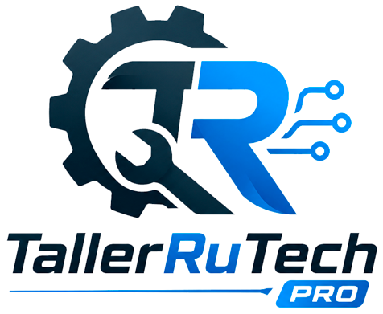

# TallerRuTech Pro

Sistema web para gestion profesional de talleres de reparacion de computadoras y equipos electronicos.

TallerRuTech Pro permite registrar clientes, crear ordenes de trabajo, documentar diagnosticos tecnicos completos, administrar tecnicos y usuarios, adjuntar imagenes, generar tickets y exportar reportes PDF para cliente y tecnico.



## Descripcion General

Este proyecto esta desarrollado con Flask, SQLite, Waitress, ReportLab, HTML, CSS y JavaScript vanilla.

El sistema esta pensado para uso interno en un taller, ya sea desde una sola computadora o desde una red local con varios equipos conectados al mismo servidor.

Funciones principales:

- Inicio de sesion con usuarios y roles.
- Panel de control con resumen de ordenes.
- Gestion de clientes.
- Registro de ordenes de trabajo.
- Diagnostico tecnico por secciones.
- Gestion de tecnicos.
- Gestion de usuarios administradores y editores.
- Configuracion de datos del taller.
- Subida de imagenes por orden.
- Generacion de PDF para cliente.
- Generacion de informe tecnico PDF.
- Impresion de ticket.
- Historial por ano, mes o dia.
- Filtros por estado, tecnico y busqueda.
- Tema claro y oscuro.

## Tecnologias Utilizadas

| Tecnologia | Uso |
| --- | --- |
| Python | Lenguaje principal del backend |
| Flask | Framework web y API |
| Waitress | Servidor WSGI para ejecutar la app |
| SQLite | Base de datos local |
| ReportLab | Generacion de archivos PDF |
| HTML, CSS, JavaScript | Interfaz del sistema |
| Tabler Icons | Iconos de la interfaz |

## Requisitos

- Python 3.10 o superior.
- pip.
- Navegador moderno: Chrome, Edge, Firefox o similar.
- Sistema operativo Windows, Linux o macOS.

En Windows se recomienda ejecutar el sistema desde una carpeta local, no desde una unidad de red compartida.

## Instalacion

### 1. Descargar el proyecto

Puedes descargar el proyecto desde GitHub:

```text
https://github.com/RuHorRu/TallerRuTech-Pro
```

O clonar el repositorio:

```bash
git clone https://github.com/RuHorRu/TallerRuTech-Pro
cd TallerRuTech-Pro
```

### 2. Crear entorno virtual

En Windows:

```bash
python -m venv venv
venv\Scripts\activate
```

En Linux o macOS:

```bash
python3 -m venv venv
source venv/bin/activate
```

### 3. Instalar dependencias

```bash
pip install -r requirements.txt
```

Si necesitas instalarlas manualmente:

```bash
pip install flask waitress reportlab
```

### 4. Ejecutar el sistema

```bash
python app.py
```

El sistema se ejecuta por defecto en:

```text
http://localhost:5000
```

Tambien puede abrirse desde otro equipo de la red usando la IP local del servidor:

```text
http://IP_DEL_SERVIDOR:5000
```

Ejemplo:

```text
http://192.168.1.50:5000
```

## Claves de Acceso

Al iniciar por primera vez, el sistema crea automaticamente un usuario administrador por defecto.

Credenciales iniciales:

```text
Usuario: admin
Contrasena: admin123
```

Importante: despues del primer inicio de sesion, cambia esta contrasena inmediatamente desde:

```text
Configuracion > Usuarios
```

Desde esa seccion puedes:

- Crear nuevos usuarios.
- Asignar rol de Administrador o Editor.
- Activar o desactivar usuarios.
- Cambiar contrasenas.
- Eliminar usuarios, excepto cuando sea el ultimo administrador disponible.

## Roles del Sistema

### Administrador

El administrador puede:

- Acceder a Configuracion.
- Gestionar usuarios.
- Gestionar tecnicos.
- Modificar datos del taller.
- Crear, editar y eliminar informacion.
- Cambiar contrasenas de usuarios.

### Editor

El editor puede trabajar con el flujo operativo del taller:

- Ver el panel principal.
- Gestionar clientes.
- Crear y editar ordenes.
- Consultar historial.
- Generar documentos relacionados con las ordenes.

La seccion de Configuracion esta reservada para usuarios administradores.

## Configuracion Inicial Recomendada

Despues de instalar el sistema:

1. Inicia sesion con `admin / admin123`.
2. Cambia la contrasena del administrador.
3. Entra a `Configuracion > Datos del Taller`.
4. Registra el nombre del taller, direccion, telefono y documento tributario.
5. Entra a `Configuracion > Tecnicos`.
6. Crea los tecnicos que atenderan las ordenes.
7. Entra a `Configuracion > Usuarios`.
8. Crea usuarios adicionales para el personal.
9. Realiza una prueba creando un cliente y una orden.
10. Genera un PDF de cliente y un PDF tecnico para verificar el flujo.

## Uso del Sistema

### Dashboard

Muestra un resumen general:

- Total de ordenes.
- Ordenes en revision.
- Ordenes esperando repuesto.
- Ordenes listas.
- Ordenes entregadas.
- Tecnicos activos.
- Equipos retrasados.

### Clientes

Permite registrar, buscar, editar y eliminar clientes.

Datos principales:

- Cedula o DNI.
- Nombres.
- Apellidos.
- Telefono.
- Correo.
- Ciudad.
- Direccion.

### Nueva Orden

La orden se registra mediante un formulario por pasos:

1. Cliente.
2. Equipo.
3. Inspeccion visual.
4. Pruebas funcionales.
5. Bateria.
6. RAM.
7. Discos.
8. Temperatura.
9. Diagnostico.
10. Presupuesto.

El sistema permite guardar informacion tecnica detallada, registrar fallas, componentes, observaciones y costos.

### Ordenes

Desde esta seccion puedes:

- Buscar ordenes.
- Filtrar por estado.
- Filtrar por tecnico.
- Ver detalle de una orden.
- Cambiar estado.
- Subir imagenes.
- Generar PDF del cliente.
- Generar PDF tecnico.
- Imprimir ticket.
- Editar ordenes.

### Historial

Permite revisar ordenes por:

- Ano.
- Mes.
- Dia especifico.
- Estado.
- Texto de busqueda.

### Configuracion

Disponible solo para administradores.

Incluye:

- Datos del taller.
- Gestion de tecnicos.
- Gestion de usuarios.

## Estados de Orden

El sistema maneja los siguientes estados:

- En revision.
- Esperando repuesto.
- Listo para entregar.
- Entregado.
- Cancelado.

## Archivos PDF

El sistema genera dos documentos principales:

### PDF Cliente

Documento orientado al cliente. Incluye:

- Datos del cliente.
- Datos del equipo.
- Falla reportada.
- Diagnostico resumido.
- Presupuesto.
- Firmas.

### PDF Tecnico

Documento interno o profesional. Incluye:

- Datos completos del equipo.
- Inspeccion visual.
- Pruebas funcionales.
- Diagnostico de bateria.
- RAM.
- Discos.
- Temperaturas.
- Diagnostico final.
- Fallas identificadas.
- Presupuesto.
- Imagenes adjuntas.

## Imagenes

Las imagenes se guardan en la carpeta:

```text
imagenes/
```

Formatos permitidos:

- JPG.
- JPEG.
- PNG.
- GIF.
- WEBP.

El sistema valida extension, tamano y tipo basico del archivo antes de guardarlo.

## Base de Datos

La base de datos principal es:

```text
taller.db
```

SQLite es suficiente para uso local o red pequena. Para 2 o 3 equipos en red local puede funcionar correctamente si el uso no es demasiado pesado.

Recomendaciones:

- No abras directamente `taller.db` mientras el sistema esta en uso.
- No coloques `taller.db` en una carpeta compartida de red.
- Ejecuta el servidor en una computadora principal.
- Los demas equipos deben acceder por navegador usando la IP del servidor.
- Evita que dos personas editen la misma orden al mismo tiempo.

## Uso en Red Local

Para usar el sistema desde varios equipos:

1. Ejecuta `python app.py` en la computadora principal.
2. Verifica la IP local del servidor.
3. Desde los otros equipos entra al navegador.
4. Abre:

```text
http://IP_DEL_SERVIDOR:5000
```

Ejemplo:

```text
http://192.168.1.50:5000
```

Notas importantes:

- El servidor debe permanecer encendido.
- La computadora servidor debe estar conectada a la misma red.
- Si Windows Firewall bloquea el acceso, permite el puerto `5000`.
- No expongas este puerto a internet.

## Copias de Seguridad

Para proteger la informacion, realiza copias periodicas de:

```text
taller.db
imagenes/
```

Recomendacion minima:

- Backup diario si el sistema se usa todos los dias.
- Backup antes de actualizar el sistema.
- Guardar copia en disco externo o nube privada.

No basta con copiar solo la base de datos si tambien se usan imagenes; las imagenes estan en una carpeta separada.

## Estructura del Proyecto

```text
taller-ru-tech-pro/
├── app.py
├── requirements.txt
├── taller.db
├── database/
│   ├── db.py
│   └── init_db.py
├── routes/
│   ├── auth.py
│   ├── clientes.py
│   ├── ordenes.py
│   ├── stats.py
│   ├── tecnicos.py
│   ├── uploads.py
│   └── usuarios.py
├── templates/
│   ├── index.html
│   └── login.html
├── static/
│   ├── css/
│   └── js/
├── assets/
│   └── logo.png
└── imagenes/
```

## Configuracion Tecnica

En `app.py` se definen:

```python
APP_HOST = '0.0.0.0'
APP_PORT = 5000
```

`0.0.0.0` permite que otros equipos de la red local puedan acceder al sistema.

Si solo quieres usarlo en la misma computadora, puedes cambiarlo a:

```python
APP_HOST = '127.0.0.1'
```

## Recomendaciones para Produccion Local

Antes de usar el sistema con informacion real:

- Cambia la contrasena del usuario `admin`.
- Crea usuarios individuales para cada persona.
- Usa una computadora servidor estable.
- Haz backups diarios.
- No compartas la base de datos directamente.
- No abras el sistema a internet.
- Revisa periodicamente la carpeta `imagenes/`.
- Protege el equipo servidor con contrasena de Windows.
- Mantén una copia actualizada del proyecto y de la base de datos.

## Solucion de Problemas

### No puedo entrar desde otro equipo

Verifica:

- Que ambos equipos esten en la misma red.
- Que estes usando la IP correcta del servidor.
- Que el servidor este ejecutandose.
- Que Windows Firewall permita el puerto `5000`.

### Olvide la contrasena

Si tienes otro usuario administrador, entra con ese usuario y cambia la contrasena desde:

```text
Configuracion > Usuarios
```

Si no tienes otro administrador, sera necesario modificar la base de datos manualmente o reinicializar usuarios con ayuda tecnica.

### No aparecen imagenes

Verifica:

- Que la carpeta `imagenes/` exista.
- Que las imagenes no hayan sido movidas o borradas.
- Que el backup incluya tambien la carpeta `imagenes/`.

### El sistema dice que la base de datos esta bloqueada

Puede ocurrir si varios usuarios escriben al mismo tiempo. Espera unos segundos y vuelve a intentar. Si ocurre con frecuencia, conviene optimizar SQLite o migrar a una base de datos mas robusta.

## Licencia

Este proyecto esta bajo licencia MIT. Consulta el archivo `LICENSE` para mas detalles.

## Contacto y Soporte

Desarrollado por **RuHor Ru Software Solutions**.

- YouTube: [RuHor](https://www.youtube.com/@RuHor)
- Facebook: [RuHor EC](https://www.facebook.com/ruhorec)
- Telegram: [Comunidad / Soporte](https://t.me/+XOG9my4p_FU5MTQx)
- Correo: correocity@outlook.com

## Donaciones

Si este proyecto te resulta util y deseas apoyar su desarrollo:

- PayPal: [https://www.paypal.com/paypalme/JorgeTene](https://www.paypal.com/paypalme/JorgeTene)

Gracias por apoyar el desarrollo de herramientas utiles para talleres y tecnicos.
